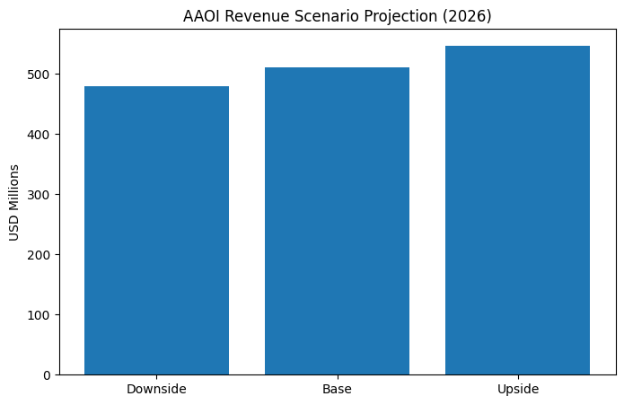
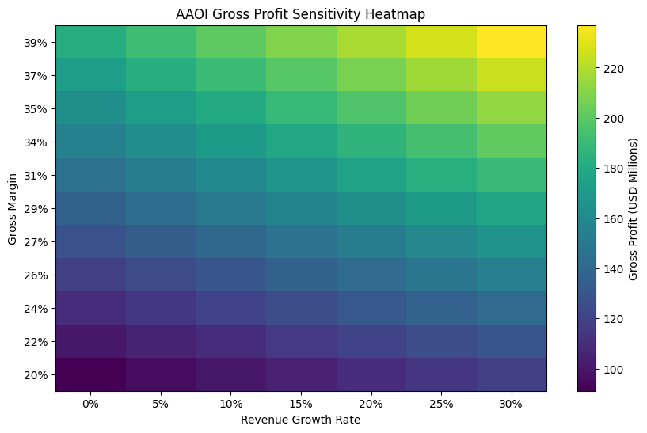
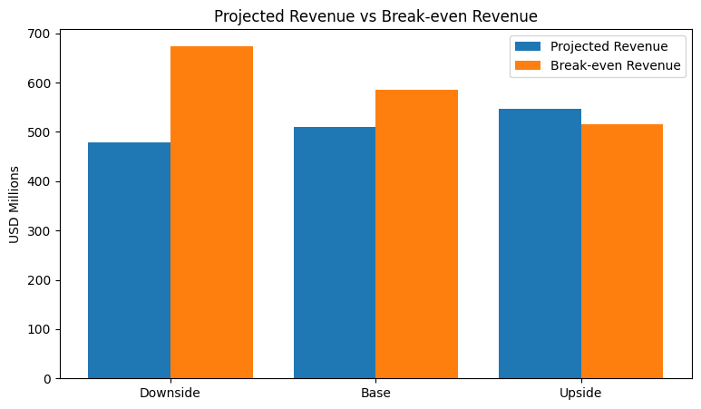

## Sample Outputs

### Revenue Scenario Projection


### Gross Profit Sensitivity Heatmap


### Break-even Analysis


# Financial Scenario & Sensitivity Modeling

A Python-based financial modeling project using historical data from Applied Optoelectronics, Inc. (AAOI) to evaluate revenue, gross profit, and break-even performance under multiple operating scenarios.

## Project Objective

This project was built to simulate how changes in revenue growth and gross margin assumptions affect financial outcomes.  
The model supports scenario planning, sensitivity analysis, and break-even assessment using simplified operating assumptions.

## Company Used

- **Applied Optoelectronics, Inc. (NASDAQ: AAOI)**

## Data Used

Historical financial inputs included:

- Revenue
- Gross margin
- Net income

All figures are expressed in **USD millions**.

## Modeling Approach

The project includes three analytical layers:

### 1. Historical Performance Review
Using AAOI historical data from 2023 to 2025:
- Revenue trend
- Gross profit trend
- Implied cost structure

### 2. 2026 Scenario Analysis
Three scenarios were modeled:

- **Downside**
- **Base**
- **Upside**

For each scenario, the model projects:
- Revenue
- Gross profit
- Cost
- Gross margin

### 3. Sensitivity Analysis
The model tests how gross profit changes under different:
- Revenue growth assumptions
- Gross margin assumptions

A heatmap is used to visualize profit sensitivity across combinations of growth and margin inputs.

### 4. Break-even Analysis
A simplified fixed cost pool is estimated from historical gross profit and net income.  
Break-even revenue is then calculated under each scenario to determine the revenue level required to cover fixed operating burden.

## Key Outputs

The project generates:

- Historical trend chart
- Scenario projection table
- Revenue scenario chart
- Gross profit sensitivity heatmap
- Break-even comparison chart

## Repository Structure

```text
financial-scenario-sensitivity-model/
├── data/
│   └── aaoi_financials.csv
├── model/
│   └── projection_model.py
├── notebooks/
│   └── scenario_model.ipynb
├── outputs/
├── README.md
└── requirements.txt

Tools Used

Python

pandas

numpy

matplotlib

Jupyter Notebook

Business Value

This project demonstrates how financial scenario modeling can support:

operating planning

downside risk assessment

margin stress testing

break-even evaluation

Possible Next Improvements

Future enhancements may include:

quarterly data integration

operating expense detail

interest expense modeling

valuation extensions

automated data ingestion from financial APIs

